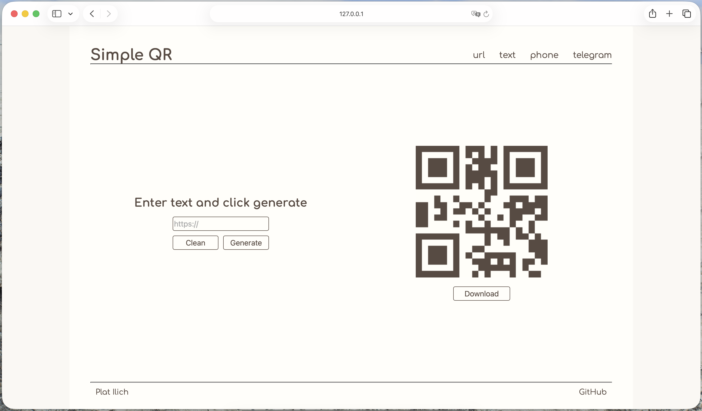

# Simple QR 🎯

A clean, aesthetic, and responsive QR Code Generator designed with absolute minimalism in mind. Built using pure HTML, CSS, and vanilla JavaScript with zero heavy frameworks.


---

## ✨ Features

* **4 Data Modes:** Seamlessly switch between generating QR codes for:
  * 🔗 **URLs**
  * 📝 **Plain Text**
  * 📞 **Phone Numbers**
  * ✈️ **Telegram Profiles**
* **Smart Telegram Handling:** Automatically converts `@username` or raw text input into a valid, clickable `https://t.me/username` deep link.
* **Beautiful Minimalist UI:** Built with a cozy beige/earthy palette, custom smooth CSS transition effects on hover/focus, and the elegant
*Comfortaa* typography.
* **Fully Responsive:** Perfectly optimized using modern CSS Media Queries to look stunning on both widescreen desktop monitors and small mobile screens.
* **Vanilla Stack:** Ultra-light footprint using native JS DOM manipulation and `qrcode.js` for rendering high-quality, sharp QR codes.

---

## 📸 Preview



---

## 🛠️ Tech Stack

* **Frontend:** HTML5, CSS3 *(Modern nesting, Flexbox, Grid, CSS custom variables)*
* **Logic:** Vanilla JavaScript *(ES6+ features)*
* **Library:** [QRCode.js](https://github.com/davidshimjs/qrcodejs) via CDN

---

## 📁 Project Structure

```text
├── index.html        # Main HTML layout & page structure
├── style.css         # Modern, responsive styles & color palette (variables)
├── script.js         # Core logic, tab switching, and QR generation
├── buttons.js        # UI Button behavior extensions
└── download.js       # Exporting logic (PNG/SVG download handlers)
```


---


📄 License

This project is open-source and available under the MIT License.

Created with ❤️ by Plat Ilich
